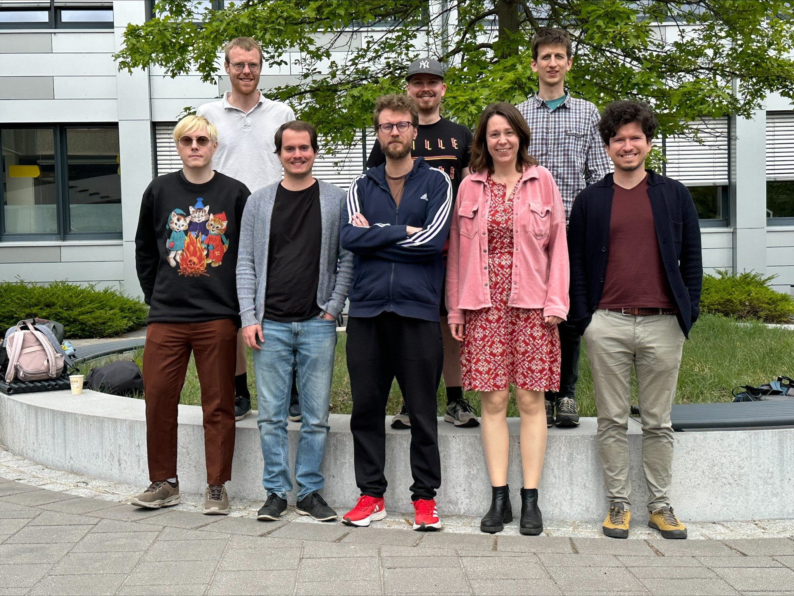

======================================
WallGo documentation
======================================

WallGo is a Python package for computing the bubble wall speed in
cosmological phase transitions. The code is open source and free to use.
If you use WallSpeed, please cite arXiv:....

|

.. toctree::
    :caption: Getting Started:
    :maxdepth: 2
    :hidden:

    intro

.. toctree::
    :caption: API Reference
    :maxdepth: 4
    :hidden:

    Boltzmann
    Collision
    EoM
    Grid
    Hydro
    Polynomial

.. toctree::
    :caption: Getting Started:
    :maxdepth: 2
    :hidden:

    contact
    development
